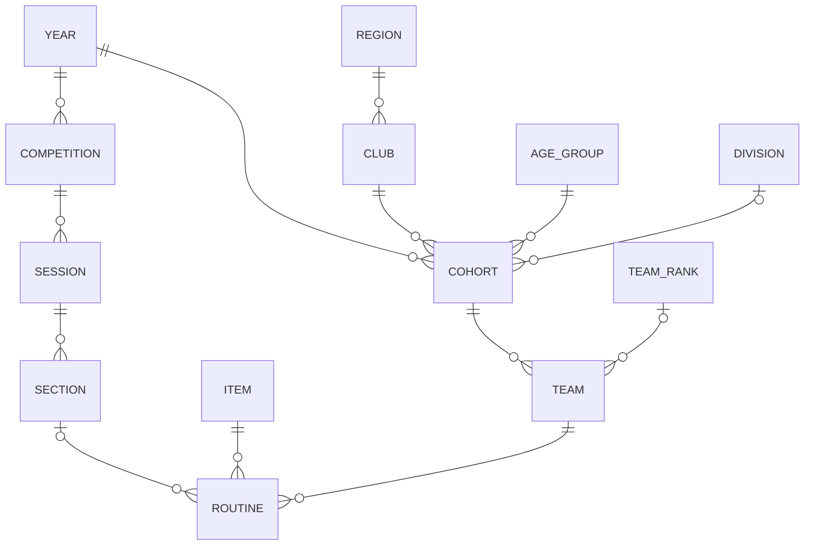
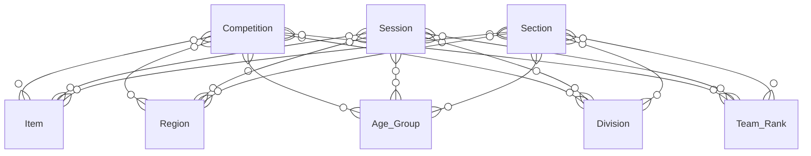

# ERDs - Entity Relationship Diagrams

## Major Entities

## Competition, Session, Section

Any given competition, session, or section 
could link to one or more objects of
any or all of these types: 

- Items 
- Regions 
- Age_Groups 
- Divisions 
- Team_Ranks 

If a Competition is linked to any one of these objects, then its Sessions and Sections are also implicitly linked to that object.

If a Session is linked to any one of these objects, then its Sections are also implicitly linked to that object.

